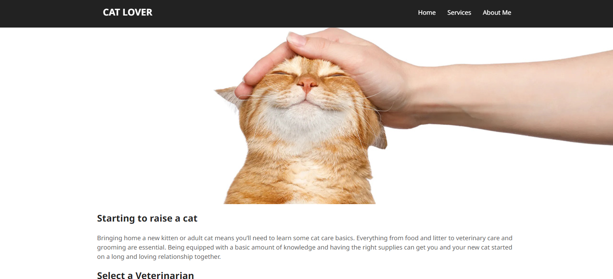

# Sticky-Navigation
This code is JavaScript used to make the Navbar or navigation menu on a website "stick" or change state when the user scrolls down several pixels (200 pixels) from the top of the page.

The nav variable is used to store references to elements with class "nav" in the DOM (Document Object Model).

When the user scrolls the page, the stickyNavbar function is called. In this function it is used. window.scrollY to view the scroll position on the Y axis of the page. If window.scrollY is greater than (>) the height of the element with class "nav" plus 200 pixels, the class "active" will be added to that element ( Navbar). Additionally, if it is not scrolled enough to meet the specified conditions, the "active" class will be removed.

In short, this code is used to make a website's Navbar "stick" or change state when the user scrolls down the page. This state transition can be used to show or hide the Navbar, or customize the style of the Navbar in various ways according to the website's needs.

Links Solution URL: [https://github.com/hedisnice/Sticky-Navigation]

Live Site URL: [https://hedisnice.github.io/Sticky-Navigation/]
